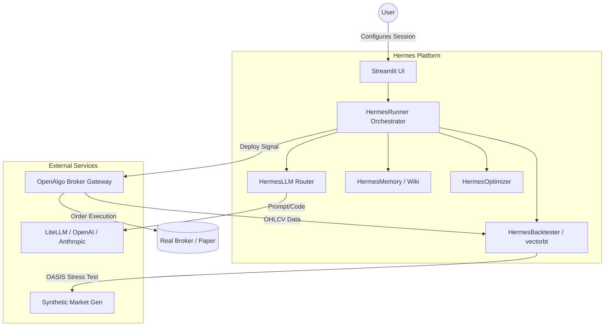
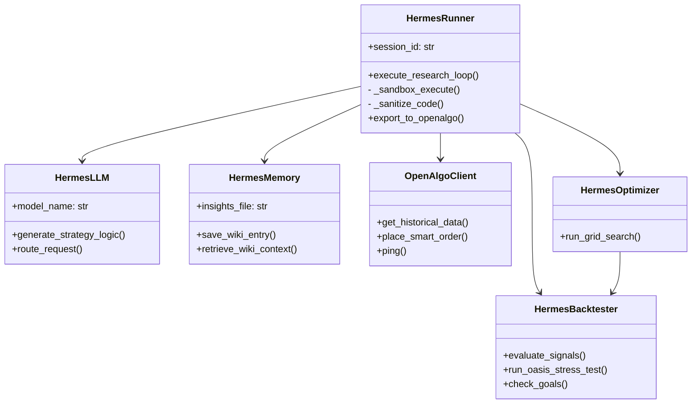
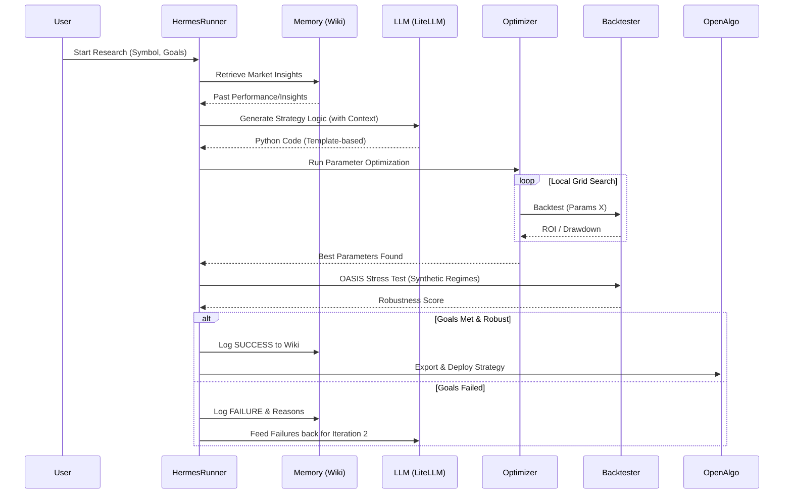

This documentation provides a comprehensive High-Level Design (HLD) and Low-Level Design (LLD) of the **Hermes AI Research Platform**, specifically structured to enable another LLM to understand and extend the codebase.

---

# 🦉 Hermes AI Research Platform Documentation

## 1. Project Overview

Hermes is an autonomous research platform designed to generate, backtest, and optimize algorithmic trading strategies using Large Language Models (LLMs). [cite_start]It bridges the gap between natural language strategy concepts and executable code, integrating with the **OpenAlgo** broker gateway for real-market deployment[cite: 1358, 1373].

**Core Capabilities:**

- [cite_start]**Autonomous Iteration:** Uses an LLM-driven loop to refine strategies based on backtest performance[cite: 1200].
- [cite_start]**Grounding & Memory:** Maintains a "Knowledge Vault" of previous successes and failures to inform future iterations[cite: 1201, 1349].
- [cite_start]**Robustness Testing (OASIS):** Subjects strategies to synthetic market regimes (volatile, crash, trending) to ensure stability[cite: 1363, 1364].
- [cite_start]**OpenAlgo Integration:** Seamlessly fetches data and deploys orders via REST API[cite: 1376, 1377].

---

## 2. High-Level Design (HLD)

### 2.1 System Architecture

Hermes operates as a multi-service architecture typically orchestrated via Docker.

- [cite_start]**Hermes Platform (The Brain):** Contains the Streamlit UI, Agent orchestration logic, and Vectorbt-powered backtester[cite: 1346, 1350, 1360].
- [cite_start]**OpenAlgo Gateway (The Hands):** A RESTful broker interface that abstracts complex broker APIs (Zerodha, Upstox) into a unified standard[cite: 1373, 1375].
- [cite_start]**LLM Engine:** External API (via LiteLLM) used for generating strategy logic and interpreting failures[cite: 1243, 1256].

### 2.2 Core Modules

1.  **`agent/`**: The orchestration hub. [cite_start]Includes the `HermesRunner` (process control), `HermesLLM` (routing), and `HermesMemory` (RAG/Wiki)[cite: 1200, 1256, 1349].
2.  [cite_start]**`backtester/`**: High-performance signal evaluation using `vectorbt` and synthetic stress testing logic[cite: 1200, 1293].
3.  [cite_start]**`data_pipeline/`**: Clean REST client for interacting with the OpenAlgo server for historical OHLCV data and trade execution[cite: 1373, 1376].
4.  [cite_start]**`hermes_strategies/`**: Repository for successful, versioned strategy files ready for deployment[cite: 1231, 1362].

### 2.3 Data Flow

1.  [cite_start]**Initialization**: User defines goals (ROI, Drawdown) in the Streamlit UI[cite: 1346, 1357].
2.  [cite_start]**Data Fetching**: `OpenAlgoClient` retrieves OHLCV data for the specified symbol/interval[cite: 1352, 1368, 1369].
3.  **Research Loop**:
    - [cite_start]**Prompting**: Agent retrieves past context and builds a prompt for the LLM[cite: 1201].
    - [cite_start]**Generation**: LLM returns Python code using a `vectorbt` template[cite: 1257].
    - [cite_start]**Execution**: Code is sanitized and run against historical data[cite: 1220, 1221].
    - [cite_start]**Optimization**: `HermesOptimizer` performs a grid search on parameters (e.g., RSI windows)[cite: 1200].
4.  [cite_start]**Evaluation**: If goals are met, the strategy undergoes OASIS stress testing[cite: 1363, 1364].
5.  [cite_start]**Deployment**: Successes are saved to the Wiki and optionally pushed to OpenAlgo[cite: 1211, 1231, 1233].

---

## 3. Low-Level Design (LLD)

### 3.1 Key Class: `HermesRunner` (agent/runner.py)

The central orchestrator for a research session.

- **Key Methods**:
  - [cite_start]`execute_research_loop(max_iterations)`: Manages the iterative flow from prompt generation to result logging[cite: 1200].
  - [cite_start]`_run_strategy(code)`: Dynamically executes LLM-generated code in a sanitized local scope[cite: 1220].
  - [cite_start]`_sanitize_code(code)`: Prevents execution of dangerous patterns like `import os` or `eval()`[cite: 1220, 1221].

### 3.2 Key Class: `OpenAlgoClient` (data_pipeline/openalgo_connector.py)

[cite_start]A stateless REST client for broker operations[cite: 1373, 1376].

- **Internal Methods**:
  - [cite_start]`_post(endpoint, payload)`: Wraps requests with the required API key and standard headers[cite: 1378, 1379].
- **Public API**:
  - [cite_start]`get_historical_data()`: Converts OpenAlgo JSON responses into pandas DataFrames[cite: 1352].
  - [cite_start]`place_smart_order()`: Places orders with automated strategy tags[cite: 1114].
  - [cite_start]`get_positions()`: Retrieves active trade books for portfolio monitoring[cite: 1127, 1128].

### 3.3 Key Class: `HermesBacktester` (backtester/engine.py)

[cite_start]Wraps `vectorbt` to provide a standardized interface for signal evaluation[cite: 1200, 1293].

- **Logic**:
  - [cite_start]Uses `vectorbt`'s `from_signals` or pre-computed indicator classes (like `vbt.RSI.run`) for speed[cite: 1178, 1189, 1293].
  - [cite_start]**Metrics**: Calculates `Total_Return_Pct`, `Max_Drawdown_Pct`, and Sharpe Ratio[cite: 1167, 1211, 1363].

### 3.4 Storage & Schema

- [cite_start]**Wiki (`hermes_wiki/`)**: Markdown files storing the history of every iteration, including code and ROI[cite: 1211, 1349].
- [cite_start]**Registry (SQLite)**: Persists session metadata, strategy performance, and robustness scores for multi-session analysis[cite: 1286].

---

## 4. Integration Guide for LLMs

To understand or modify this repo, focus on these entry points:

1.  [cite_start]**Adding a New Indicator**: Update the "Skills Cheat Sheet" in `HermesLLM` to inform the generator[cite: 1258].
2.  [cite_start]**Modifying Optimization**: Adjust `HermesOptimizer` to change how parameter ranges are explored[cite: 1200].
3.  [cite_start]**Extending Data Sources**: Add a new connector class similar to `OpenAlgoClient` and update the `app.py` selector[cite: 1350, 1376].

[cite_start]**Safety Note:** All LLM-generated code must contain an `evaluate(df, params)` function and a `PARAM_RANGES` dictionary to be compatible with the backtester and optimizer[cite: 1178, 1189, 1220].

The structure of your **Hermes Research Platform** is highly robust for an agentic framework. [cite_start]Based on the provided files[cite: 13, 1143, 1167], I have analyzed the repository for completeness and generated the requested diagrams.

### 1. Repository Audit: What’s Missing or Can Be Improved

[cite_start]While the core "LLM → Optimization → Backtest" loop is well-implemented[cite: 1152], here are the key areas to strengthen the repo before handing it to another LLM:

- [cite_start]**Structured Testing Suite**: You have `test_vbt_syntax.py` and `test_connection.py`[cite: 1, 11], but the repository lacks a dedicated `/tests` directory with **Unit Tests** for the `backtester` logic and **Integration Tests** for the `OpenAlgoClient`.
- [cite_start]**Centralized Logging**: The code currently uses `print()` statements and internal list appending (`self.iteration_log`)[cite: 13, 14]. For production, a standard `logging` module setup would allow the other LLM to debug the agent's internal state more effectively.
- [cite_start]**Advanced Sandbox Isolation**: `_sanitize_code` uses basic string matching and a restricted `exec()`[cite: 15, 727]. Consider a more formal sandbox (like `RestrictedPython` or a micro-container approach) if the other LLM will be generating complex logic.
- [cite_start]**Strategy Metadata Registry**: You have an iteration log, but a formal **Strategy Registry** (e.g., a simple SQLite DB or JSON file) that maps a `Strategy_ID` to its specific `.py` file, performance metrics, and OASIS robustness score would make the system more searchable[cite: 20].
- [cite_start]**Dependency Locking**: While you have a `Makefile`[cite: 1143], ensuring a `requirements.txt` or `pyproject.toml` is present in the root (not just referenced in Docker) helps LLMs understand the environment constraints immediately.

---

### 2. High-Level Design (HLD)

This diagram illustrates how the Hermes Platform interacts with external services like the LLM Provider and the OpenAlgo Broker Gateway.

---

### 3. Low-Level Design (LLD): Class Diagram

This shows the internal relationships between your core classes.

---

### 4. Sequence Diagram: Autonomous Research Loop

This diagram traces the lifecycle of a single research session from concept to deployment.

### Summary for another LLM

[cite_start]If you give this to another LLM, describe it as: _"A hybrid AI-Quant platform that uses LLMs for strategy hypothesis generation and local math (vectorbt/grid search) for parameter validation, utilizing a RAG-based 'Wiki' for iterative memory and OpenAlgo for REST-based broker execution"_[cite: 1148, 1152].
